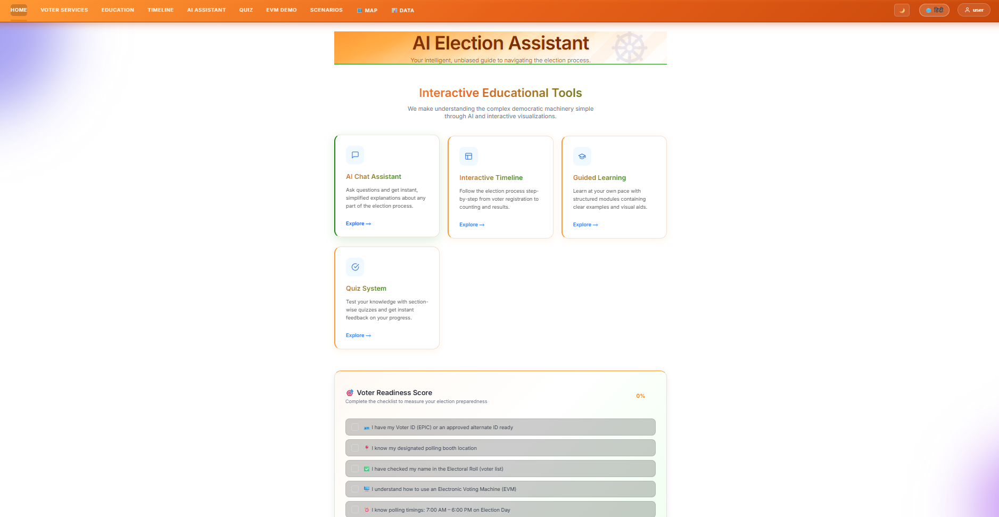
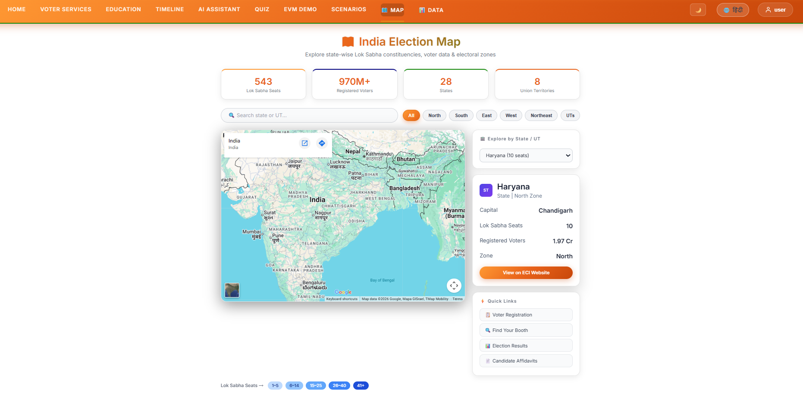
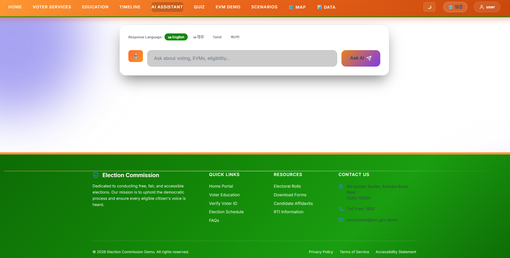

# 🗳️ AI Election Process Guide

## 📌 Project Overview

The **AI Election Process Guide** is a production-ready, full-stack application designed to modernize election education in India. It leverages a powerful suite of **Google Cloud Services** to deliver an accessible, personalized, and intelligent voting journey for every citizen.

By combining **Generative AI (Gemini)** with **Real-time Translation, Voice Synthesis, and Sentiment Analysis**, the platform ensures election information is not just available—but truly understandable.

---

## 🎯 Challenge Vertical

**Election Process Education & Accessibility**

---

## 🚀 Live Demo & Deployment

👉 **Production URL**: [https://ai-election-assistant-130588119495.us-central1.run.app](https://ai-election-assistant-130588119495.us-central1.run.app)

---

## 📸 Screenshots





---

## ✨ Premium Features (Powered by Google Cloud)

### 🤖 Smart AI Assistant (Gemini 2.0 Flash)

- **Hybrid Intelligence**: Combines rule-based responses with advanced Gemini reasoning.
- **Context-Aware**: Uses user profile (age, state) for personalized guidance.
- **Sentiment-Aware**: Adapts tone using **Natural Language API**.

### 🌐 Real-time Localization (Cloud Translation API)

- **Multi-language support**: Hindi, Tamil, Bengali, Telugu.
- **Official SDK**: Uses the professional Google Cloud Translation engine for accuracy.

## 🌍 Real-World Impact
- Simplifies complex election processes for first-time voters
- Improves accessibility through multilingual and voice support
- Reduces confusion using AI-powered guidance and scenarios

### 🎙️ AI Voice Responses (Cloud Text-to-Speech)

- **Neural Voice Synthesis**: High-quality audio responses in English and Hindi.
- **Accessibility First**: Designed for visually impaired users.

### 🔐 Secure Identity & Persistence (Firebase)

- **Google Sign-In**: Secure authentication via **Firebase Auth**.
- **Real-time Leaderboard**: Global quiz ranking powered by **Firestore**.
- **Persistent Tracking**: User interaction logging and history.

---

## 🧠 AI Processing Pipeline

1.  **Rule-Based Engine**: Instant responses for common FAQs.
2.  **Gemini AI**: Deep reasoning for complex voter queries.
3.  **Cloud Translation**: Dynamic output in the user's preferred language.
4.  **Natural Language API**: Tone adjustments based on detected sentiment.

---

## 📊 Interactive Experience

- **🎭 Scenario Simulator**: Practice real-life voter situations (Lost ID, Name Missing).
- **🎓 Guided Learning Modules**: Progress tracking through election essentials.
- **🗳️ EVM & VVPAT Interactive Demo**: Visual walkthrough of voting machines.
- **🗺️ Interactive Election Data Map**: Regional stats and voter data visualization.
- **🥇 Gamified Quiz**: Test knowledge with a Global Leaderboard.

---

## 🏗️ Technical Architecture

### **Backend (Python + Flask)**

- **Modular Design**: Clean separation of AI logic, services, rules, and database layers.
- **Security**: Rate limiting (**Flask-Limiter**), input validation, and sanitization.
- **Production-grade**: Scalable architecture with comprehensive logging.

### **Frontend (HTML, CSS, JavaScript)**

- **Modern UI**: Glassmorphism design with smooth animations.
- **Responsive**: Optimized for both mobile and desktop.
- **Telemetry**: Integrated **Google Analytics (GA4)** for engagement tracking.

---

## ☁️ Google Cloud Stack

| Service                    | Purpose                           |
| :------------------------- | :-------------------------------- |
| **Gemini 2.0 Flash**       | Core AI Generative Engine         |
| **Cloud Translation**      | Professional Multilingual Support |
| **Cloud Text-to-Speech**   | Neural Voice Synthesis            |
| **Cloud Natural Language** | Sentiment & Tone Analysis         |
| **Firebase Auth**          | Secure Identity Management        |
| **Firebase Firestore**     | Real-time Database & Chat History |
| **Google Analytics (GA4)** | User Telemetry & Insights         |
| **Cloud Run**              | Serverless Containerized Hosting  |

---

## 🛡️ Security & Reliability

- **Rate Limiting**: Protection against spam and API abuse.
- **Hygiene**: Strictly enforced `.gitignore` (no sensitive files like `firebase-key.json` or caches tracked).
- **Validation**: Secure input handling to prevent XSS and injection.

---

## 🧪 Testing & Quality

- **Automated Testing**: 45+ test cases covering unit and integration scenarios.
- **High Coverage**: ~95%+ test coverage for core business logic.

**Run tests:**

```bash
pytest
```

---

## ⚡ Performance & Scalability

- **Serverless**: Deployed via Cloud Run for automatic scaling.
- **Hybrid Latency**: Ultra-fast responses via the Rule Engine + Gemini fallback.

---

## 🛠️ Installation & Local Setup

1. **Clone the Repo**

   ```bash
   git clone https://github.com/Sahil-242-ops/AI-Election-Process-Guide.git
   cd AI-Election-Process-Guide
   ```

2. **Install Dependencies**

   ```bash
   pip install -r requirements.txt
   ```

3. **Configure Secrets**

   ```bash
   export API_KEY="your_gemini_api_key"
   export GOOGLE_APPLICATION_CREDENTIALS="path/to/firebase-key.json"
   ```

4. **Run Application**
   ```bash
   python app/app.py
   ```

---

## 🏁 Conclusion

This project demonstrates how modern AI and cloud technologies can transform civic education into an interactive, accessible, and intelligent experience.

---

## 🙌 Author

**Sahil**  
Dedicated to making democracy accessible through technology.
