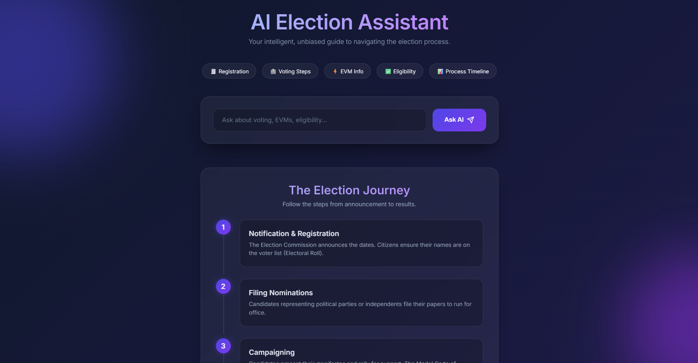

# 🗳️ AI Election Guide Assistant

## 📌 About Project
AI Election Guide Assistant is a web-based application that helps users understand the election process in India in a simple and interactive way.

It provides accurate information about voting, registration, eligibility, EVM, election stages, and more.

The system combines rule-based logic with AI to deliver reliable and easy-to-understand answers.

---

## 🚀 Live Demo
👉 https://ai-election-assistant-130588119495.us-central1.run.app

---

## 📸 Screenshots


---

## ✨ Features
- 🧾 Voter registration guidance  
- 🗳️ Step-by-step voting process  
- ⚡ EVM & VVPAT explanation  
- ✅ Eligibility criteria (18+ rule)  
- 📊 Election timeline & stages  
- 🏛️ Election Commission information  
- 🤖 AI-powered answers for additional queries  
- 🌐 Modern interactive UI with animations  
- 📱 Responsive design (mobile-friendly)  

---

## 🛠️ Technologies Used
- Python (Flask)  
- Google Gemini API (`google-genai`)  
- HTML, CSS, JavaScript  
- Google Cloud Run (Deployment)  

---

## ⚙️ How It Works
- The application first checks user input using keyword-based logic.
- If a match is found → predefined accurate response is returned.
- If no match → AI (Gemini API) generates a simple explanation.
- The frontend sends requests to `/ask` API and displays formatted responses.

---

## 🖥️ Deployment (Google Cloud Run)
The app is deployed using Cloud Run:

- Containerized using Docker  
- Deployed via `gcloud run deploy`  
- Public access enabled  
- API key stored securely as environment variable  

---

## ▶️ Run Locally

### 1. Clone repository
```bash
git clone https://github.com/YOUR-USERNAME/ai-election-assistant.git
cd ai-election-assistant
```

### 2. Install dependencies
```bash
pip install -r requirements.txt
```

### 3. Set environment variables
```bash
export API_KEY="your_gemini_api_key"
export PORT=8080
```

### 4. Run the app
```bash
python app.py
```
